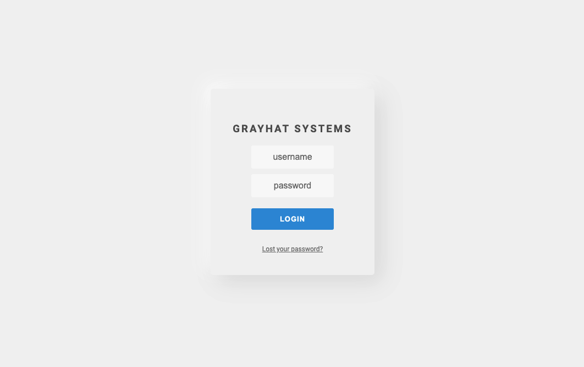
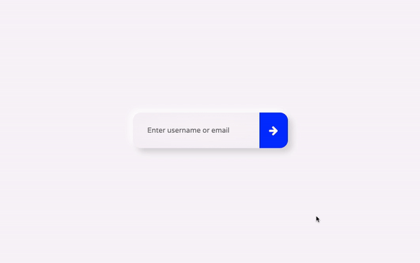
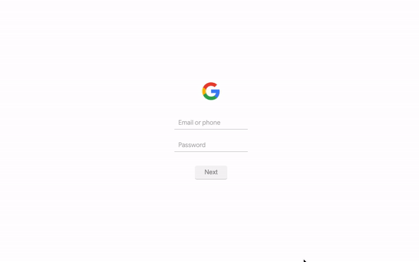

# lightest-login-form-ever
100 days of beautiful login forms, under 100 lines of code (2KB).

[Website for live demos](https://saadbazaz.github.io/lightest-login-form-ever/)

## Sample Screenshots
### 1

### 2

### 3

### 4

## Why?
While messing on an Arduino Ethernet Shield trying to create a simple webserver, I realized that all the examples and blogs of "Lightest Login Form" and "Simplest Login Form" pointed towards really really heavy examples which just 'looked' light and simple (i.e. minimalistic). Knowing that the Arduino has a built-in memory equivalent to a walnut, I had to do something about it.

In this repo I explore the lightest possible login form which has minimal amount of code, smallest size, most functionality but also looks really pretty.

## Note
Please feel free to add more to this awesome collection through Pull Requests!

⭐ Star this repo and follow me for more good code.

✉️ Feel free to contact me at saadbazaz@hotmail.com
